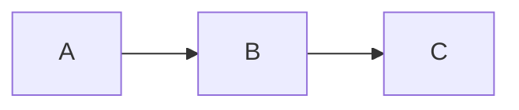

# Images, Assets, Math, and Diagrams

Static blogs without thought go on with massive PNGs, no responsive `srcset`, no lazy loading, and a megabyte of unused CSS. This file covers the image pipeline that brings a Jekyll site up to modern Core Web Vitals targets, plus the related rendering pipelines for math and diagrams.

## Table of contents

1. [The four-step image plan](#the-four-step-image-plan)
2. [Hand-rolled responsive images](#hand-rolled-responsive-images)
3. [Jekyll Picture Tag (`jekyll-picture-tag`)](#jekyll-picture-tag-jekyll-picture-tag)
4. [Lazy loading](#lazy-loading)
5. [WebP and AVIF](#webp-and-avif)
6. [Pre-build image optimization in CI](#pre-build-image-optimization-in-ci)
7. [Asset fingerprinting / cache busting](#asset-fingerprinting--cache-busting)
8. [Math rendering: MathJax and KaTeX](#math-rendering-mathjax-and-katex)
9. [Diagrams: Mermaid, PlantUML, D2](#diagrams-mermaid-plantuml-d2)
10. [SVG inlining](#svg-inlining)

---

## The four-step image plan

Most Jekyll sites can hit good Lighthouse scores with just these four moves. Do them in order:

1. **Compress.** Pre-compress source images before they enter the repo. `cwebp`, `avifenc`, `oxipng`, `mozjpeg`. A 2MB PNG hero almost always shrinks to <200KB.
2. **Resize.** Don't ship a 4032×3024 phone photo when the layout is 720px wide. Generate three or four widths.
3. **Serve modern formats.** WebP and AVIF for browsers that take them, JPEG/PNG as fallback.
4. **Lazy load.** Native `loading="lazy"` and `decoding="async"` on every `` below the fold.

If you can't be bothered with steps 2–3 manually, install `jekyll-picture-tag` (below) to automate them at build time.

## Hand-rolled responsive images

If you have only a handful of images, this is fine and avoids plugins:

```html

```

- `srcset` lists `path widthDescriptor`.
- `sizes` tells the browser the layout width at each viewport — *required* for `srcset` to be effective.
- `width` and `height` attributes prevent layout shift (CLS in Core Web Vitals).

Generate the resized variants with ImageMagick or `sharp`:

```bash
for w in 360 720 1440; do
  magick photo.jpg -resize "${w}x" -strip "photo-${w}.jpg"
done
```

## Jekyll Picture Tag (`jekyll-picture-tag`)

For a site with dozens of images, this automates resizing, format conversion, and the entire `<picture>` element from one Liquid tag.

```ruby
# Gemfile
gem "jekyll-picture-tag", "~> 2.1"
```

```yaml
# _config.yml
plugins:
  - jekyll-picture-tag

picture:
  source: assets/images          # where you put originals
  output:  generated              # where outputs go (in _site/)
  presets:
    default:
      formats: [webp, original]
      widths:  [360, 720, 1440]
      attributes:
        img: 'loading="lazy" decoding="async"'
```

In Markdown or HTML:

```liquid

```

At build time, it generates `photo-360.jpg`, `photo-360.webp`, `photo-720.jpg`, ... and emits the full `<picture>` element with proper `srcset` and `sizes`. Output cached between builds — only new/changed images get reprocessed.

Trade-off: Not on the GitHub Pages allowlist. You need to build the site yourself (GH Actions, Netlify, etc.).

## Lazy loading

Native browser lazy loading is universal in 2026:

```html

<iframe src="..." loading="lazy"></iframe>
```

Rules:
- Don't lazy load above-the-fold images (hero, logo). They should load eagerly.
- Always pair with `width` and `height` so layout doesn't jump as images load.

For old-browser JS fallbacks: not worth it in 2026. The behavior degrades gracefully — old browsers just load eagerly.

## WebP and AVIF

- **WebP**: ~30% smaller than JPEG at similar quality. Universal support.
- **AVIF**: ~50% smaller than JPEG. Supported by all major browsers but encoders are slow.

Always keep a JPEG/PNG fallback for safety:

```html
<picture>
  <source srcset="photo.avif" type="image/avif">
  <source srcset="photo.webp" type="image/webp">
  
</picture>
```

Generate AVIF in CI (slow, do it once per image):

```bash
avifenc --min 25 --max 35 -j 4 photo.jpg photo.avif
```

Or let `jekyll-picture-tag` handle it via its `formats: [avif, webp, original]` preset.

## Pre-build image optimization in CI

Add a step in your GitHub Actions workflow that runs before `jekyll build`:

```yaml
- name: Optimize images
  run: |
    sudo apt-get install -y webp
    find assets/images -name '*.jpg' -exec sh -c '
      cwebp -q 80 "$1" -o "${1%.jpg}.webp"
    ' _ {} \;
```

For complex pipelines, the `sharp` CLI in a small Node script is more flexible:

```bash
npm i -D sharp-cli
npx sharp -i 'assets/images/**/*.jpg' -o assets/images-out --format webp --quality 80
```

Cache the output between runs so you don't reprocess on every commit.

## Asset fingerprinting / cache busting

CSS and JS files change but the URL stays `/assets/css/main.css`. Without a cache-busting strategy, users get stale styles after every deploy.

### Quick and easy: timestamp query string

```html
<link rel="stylesheet"
      href="{{ '/assets/css/main.css' | relative_url }}?v={{ site.time | date: '%s' }}">
```

`site.time` is the build time. Every build gets a new query param, so every deploy busts the cache. Trade-off: the file URL changes on every build even if the file didn't, so CDNs that key on URL get extra writes — usually fine.

### Better: hash-based fingerprint

Compute the content hash once per build and inject it into the URL. Two ways:

**a) Hash the file at template time:**

```liquid

<link rel="stylesheet"
      href="{{ '/assets/css/main.css' | relative_url }}?v={{ css_hash | slice: 0, 8 }}">
```

(This needs a custom filter or a plugin that exposes `sha256` on a file — see [advanced.md](advanced.md) for writing one.)

**b) Rename the file at build time** with a post-build step:

```bash
hash=$(sha256sum _site/assets/css/main.css | cut -c1-8)
mv "_site/assets/css/main.css" "_site/assets/css/main.${hash}.css"
sed -i "s|/assets/css/main.css|/assets/css/main.${hash}.css|g" _site/**/*.html
```

This is what `jekyll-assets` and similar plugins automate. For most sites, the query-string approach is sufficient and simpler.

## Math rendering: MathJax and KaTeX

You have two production-ready options:

### MathJax 3

Server: pure client-side rendering, slower but most-compatible.

```html
<!-- in your layout, gated to pages with math -->

<script>
  MathJax = {
    tex: { inlineMath: [['\\(', '\\)']], displayMath: [['$$', '$$']] }
  };
</script>
<script id="MathJax-script" async
        src="https://cdn.jsdelivr.net/npm/mathjax@3/es5/tex-mml-chtml.js"></script>

```

In a post:

```yaml
---
title: Math Post
math: true
---
The classic identity is $$ e^{i\pi} + 1 = 0 $$.
```

### KaTeX

Faster client-side render, smaller payload.

```html

<link rel="stylesheet"
      href="https://cdn.jsdelivr.net/npm/katex@0.16.11/dist/katex.min.css">
<script defer
        src="https://cdn.jsdelivr.net/npm/katex@0.16.11/dist/katex.min.js"></script>
<script defer
        src="https://cdn.jsdelivr.net/npm/katex@0.16.11/dist/contrib/auto-render.min.js"
        onload="renderMathInElement(document.body);"></script>

```

KaTeX is usually faster and a smaller dependency, but doesn't support 100% of LaTeX — check its [function list](https://katex.org/docs/supported.html) before committing.

### Pre-render at build time (no client-side JS)

Use kramdown with `math_engine: mathjaxnode`. Needs Node available in the build environment. Heavier setup, but pages then load without any math JS at runtime — better for performance and accessibility.

See [kramdown.md](kramdown.md) for the kramdown config.

## Diagrams: Mermaid, PlantUML, D2

### Mermaid (most common)

Embedded JS that renders code blocks marked `language-mermaid` into diagrams.

```html

<script type="module">
  import mermaid from 'https://cdn.jsdelivr.net/npm/mermaid@10/dist/mermaid.esm.min.mjs';
  mermaid.initialize({ startOnLoad: true });
</script>

```

In Markdown:

````markdown

````

By default kramdown wraps it in `<pre><code class="language-mermaid">...</code></pre>`; Mermaid's script picks it up.

### D2

Modern alternative with cleaner syntax. Renders best server-side via a CLI:

```bash
brew install d2
d2 diagram.d2 diagram.svg
```

Generate SVGs as a pre-build step, then include them with `` or ``.

### PlantUML

Heavier (Java + Graphviz). Use only if you already have PlantUML somewhere — otherwise Mermaid or D2 are simpler.

## SVG inlining

Inline SVG is the most flexible — you can style it with CSS, change fill on hover, etc. Use Jekyll's `include` for the whole file:

```liquid
<span class="icon"></span>
```

Store icons in `_includes/svg/`. They get inlined byte-for-byte; you can style classes on the `<svg>` from outside.

Note: paths inside SVG (like `<image href="...">`) won't go through `relative_url` automatically. If you ship logos referencing other images, prefer raster assets or post-process the SVG.

## Things to drop

- **`jekyll-responsive-image`**: largely unmaintained, replaced by `jekyll-picture-tag`.
- **Lightboxes that download lightbox CSS/JS for every page**: lazy-load the lightbox itself only on pages that have lightbox-eligible images.
- **Re-encoding the same image on every build**: cache the output directory; `jekyll-picture-tag` already does this.

## Further reading

- `jekyll-picture-tag`: <https://rbuchberger.github.io/jekyll_picture_tag/>
- Web.dev image guide: <https://web.dev/learn/images/>
- Squoosh (interactive compressor): <https://squoosh.app/>
- MathJax 3: <https://docs.mathjax.org/>
- KaTeX: <https://katex.org/>
- Mermaid: <https://mermaid.js.org/>
- D2: <https://d2lang.com/>
